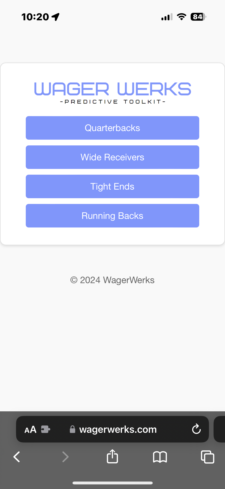
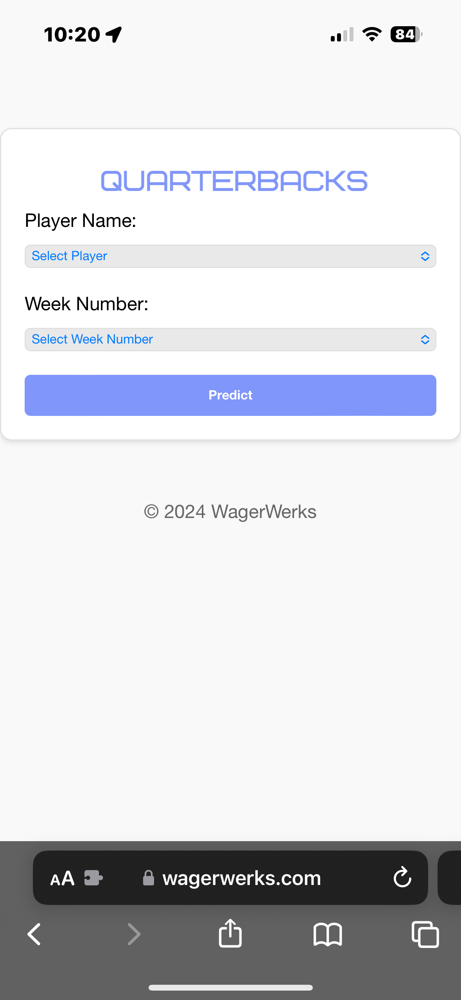
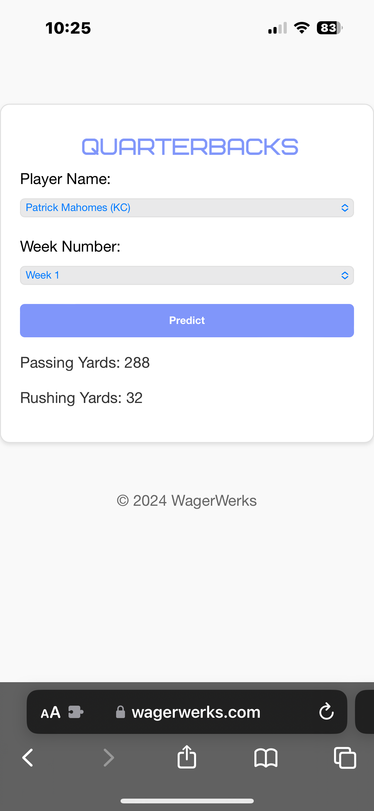

# Wager Werks: Predictive Toolkit
**Elevate your sports betting with Wager Werks: Predictive Toolkit.** With our sophisticated machine learning models tailored for individual player positions, you're equipped to make smarter, more informed wagers across every game.

  
  
  

## Why Choose Wager Werks?

- **Position-Specific Models:** Tailored for tight ends, quarterbacks, running backs, and wide receivers to align with position specific variables.
- **Time-Saving Automation:** Wager Werks collects the data and calculates performance variables, automating the research and eliminating the guesswork from your bets.
- **Public Access to Professional Tools:** Leverage the same sophisticated machine learning technology used by sportsbooks and professional handicappers.
- **User-Friendly Interface:** Simply enter the player's name and the NFL season week number to receive performance predictions.
- **Proven Success:** Achieved a **67% win percentage** with a **14% ROI** during the 2023 NFL playoffs.

## Transform Your NFL Betting Strategy

Save time and improve your odds with Wager Werks. Compare our predictions to sportsbook lines and place smarter bets!

**Want to become a user?** Email us at [wagerwerks@outlook.com](mailto:wagerwerks@outlook.com) to get started!
